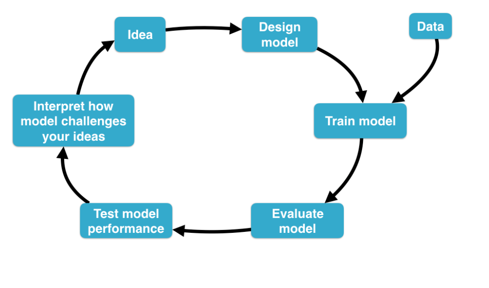
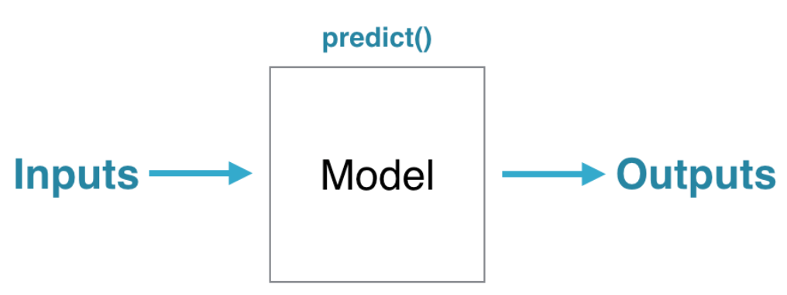

```{r setup, include=FALSE}
knitr::opts_chunk$set(echo = TRUE,
                      warning = FALSE,
                      message = FALSE,
                      fig.align = "center",
                      fig.width = 9)
```

<center>

</center>

# Contenido del curso

1. **Capítulo 1:** ¿Qué es el modelado estadístico?
2. **Capítulo 2:** Diseñar, entrenar y evaluar modelos
3. **Capítulo 3:** Evaluación del desempeño de la predicción
4. **Capítulo 4:** Explorando datos con modelos
5. **Capítulo 5:** Covariables y tamaño del efecto

# Capítulo 1

## Notas

- En todo el curso se hace uso masivo de tres tipos de objetos:
  - *Dataframes*
  - Fórmulas (`Y ~ X`)
  - Funciones (`mean`, `lm`...)
- Un modelo es una representación simple de la realidad.
- Un modelo estadístico es una representación de la realidad basado en datos.
- El modelamiento no es un resultado en sí mismo, es un proceso. La pregunta que se desea responder con el modelado debe ser clara para cumplir con el objetivo propuesto.

<center>

</center>

## Biblioteca `mosaic`  
  
- La biblioteca [mosaic](https://cran.r-project.org/web/packages/mosaic/index.html) permite utilizar la notación de fórmulas para algunas funciones que R no lo permite normalmente, por ejemplo, `mean`:

```{r}
library(mosaic)
mean(Sepal.Length ~ Species, data = iris)
```

- También tiene funciones específicas para graficar con `ggplot2` a través de la notación de fórmula (empiezan con el prefijo `gf_`):

```{r}
gf_boxplot(Sepal.Length ~ Species, data = iris)
```

```{r}
gf_point(iris$Sepal.Length ~ iris$Petal.Length)
```

# Capítulo 2

## Ajuste de modelos

- Datos: `Runners`. Este conjunto de datos está disponible en la biblioteca *statisticalModeling*. Puede ser obtenido directamente desde el repositorio de Github de [Daniel Kaplan.](https://github.com/dtkaplan/statisticalModeling/blob/master/data/Runners.rda) 
- En este ejemplo se constuyen tres modelos lineales (`lm()`) y tres modelos (árboles) con particionamiento recursivo (`rpart()`):
  - $net \sim age$
  - $net \sim sex$
  - $net \sim age + sex$
  
```{r}
# Cargando datos
load("data/Runners.rda")

# Modelos
model1_lm <- lm(net ~ age, data = Runners)
model2_lm <- lm(net ~ sex, data = Runners)
model3_lm <- lm(net ~ age + sex, data = Runners)
```

- Es posible visualizar los tres modelos anteriores a través de la función `fmodel()` que está disponible en la biblioteca [statisticalModeling](https://github.com/dtkaplan/statisticalModeling):

```{r}
library(statisticalModeling)
fmodel(model1_lm)
fmodel(model2_lm)
fmodel(model3_lm)
```

- **Modelos `rpart()`:**

```{r}
# Modelos
library(rpart)
model1_rpart <- rpart(net ~ age, data = Runners)
model2_rpart <- rpart(net ~ sex, data = Runners)
model3_rpart <- rpart(net ~ age + sex, data = Runners)
model3_rpart_cp <- rpart(net ~ age + sex, cp = 0.002, data = Runners)
```

- **Visualizando modelos:**

```{r}
fmodel(model3_rpart_cp, ~ age + sex)
```

## Evaluación de modelos
  
<center>

</center> 

- Se ajusta un modelo lineal con la base de datos [AARP.](https://github.com/dtkaplan/statisticalModeling/blob/master/data/AARP.rda)

```{r}
load("data/AARP.rda")
insurance_cost_model <-  lm(Cost ~ Age + Sex + Coverage, data = AARP)
```

- Predicción sobre nuevos datos:

```{r}
# Construct a data frame: example_vals 
example_vals <- data.frame(Age = 60, Sex = "F", Coverage = 200)

# Predict insurance cost using predict()
predict(object = insurance_cost_model, newdata = example_vals)

```

- Predicción utilizando la función **`evaluate_model()`** de la biblioteca `statisticalModeling`:

```{r}
evaluate_model(insurance_cost_model, example_vals)
```

- Es posible evaluar de forma gráfica los resultados del modelo:

```{r}
fmodel(insurance_cost_model, ~ Coverage + Age + Sex)
```

- Cambiando de orden las facetas y ejes:

```{r}
new_formula <- ~ Age + Sex + Coverage
fmodel(insurance_cost_model, new_formula)
```

# Capítulo 3

## Comparando dos modelos

- En este ejemplo la comparación está orientada a evaluar la importancia de incluir una variable adicional al modelo.
- En este caso se comparan dos modelos lineales (`lm`) a través del cuadrado medio del error:

$$CME = \frac{1}{n}\sum_{i=1}^{n}(y - \hat{y})^2$$

```{r}
# Datos sin NA
Runners_noNA <- na.omit(Runners)

# Modelos
mod1 <- lm(net ~ age, data = Runners_noNA)
mod2 <- lm(net ~ age + sex, data = Runners_noNA)

# Predicciones
pred_mod1 <- predict(mod1, newdata = Runners_noNA)
pred_mod2 <- predict(mod2, newdata = Runners_noNA)

# CME
mean((Runners_noNA$net - pred_mod1)^2)
mean((Runners_noNA$net - pred_mod2)^2)
```

## Training - Testing

- División de datos en entrenamiento (*training*) y prueba (*testing*) para evaluar la capacidad predictiva del modelo.
- Aunque hay funciones en algunos paquetes de R para ejecutar la división de datos de manera sistemática y rápida, en este ejemplo se opta por hacerlo manualmente.

```{r}
# Generación aleatoria de TRUE y FALSE
set.seed(2020)
Runners_noNA$training_cases <- rnorm(nrow(Runners_noNA)) > 0

# Modelo
base_model <- lm(net ~ age + sex, data = subset(Runners_noNA, training_cases))

# Evaluando el modelo en casos nuevos (testing)
Preds <- evaluate_model(base_model, data = subset(Runners_noNA, !training_cases))

# Calculate the MSE on the testing data
with(data = Preds, mean((net - model_output)^2))
```


## Validación cruzada

### Comparando errores de predicción

- En el ejemplo anterior se ejecutó validación cruzada simple, con una sola partición de entrenamiento y prueba. Es posible repetir el preceso de remuestreo y obtener el error de predicción a través de validación cruzada, luego se puede contrastar con el error de predicción ajustado con todos lo datos y a través de la prueba *t-student* determinar si son estadísticamente diferentes.
- La biblioteca *statisticalModeling* tiene consigo la función `cv_pred_error()` que permite ajustar validación cruzada más de una vez.

```{r}
# Modelo base con todos los datos
mod_base <- lm(net ~ age + sex, data = Runners_noNA)

# Evaludación del modelo
eval_mod_base <- evaluate_model(mod_base, data = Runners_noNA)
mse_mod_base <- with(eval_mod_base, mean((net - model_output)^2))
mse_mod_base
```

- **Modelo con validación cruzada:**

```{r}
error_cv <- cv_pred_error(mod_base, ntrials = 5)
error_cv
```

- **Comparando error del modelo base vs error de validación cruzada:** son estadísticamente diferentes, el intervalo de confianza del error con validación cruzada se ubica a la derecha del error del modelo base. Este resultado permite evidenciar lo "optimista" que puede llegar a ser el ajuste de un modelo predictivo con los datos completos.

```{r}
mosaic::t.test(~ mse, mu = mse_mod_base, data = error_cv)
```

### Elegir una variable para el modelo

- En este caso se va a utilzar la validación cruzada para definir si la inclusión de una nueva variable resulta siendo favorable en la capacidad predictiva del modelo.

```{r}
# Modelo con sólo edad
modelo_base <- lm(net ~ age, data = Runners_noNA)

# Modelo con edad y género
mod_dos <- lm(net ~ age + sex, data = Runners_noNA)

# Comparando con validación cruzada ambos modelos
res_modelos <- cv_pred_error(modelo_base, mod_dos, ntrials = 5)
res_modelos
```

- **Prueba *t-student* para comparación de medias (dos poblaciones):** las diferencias entre los modelos son estadísticamente significativas, siendo inferior el *MSE* del modelo dos, lo que permite afirmar que la inclusión de la variable *sex* es provechosa para la capacidad predictiva del modelo.

```{r}
mosaic::t.test(mse ~ model, data = res_modelos)
```

